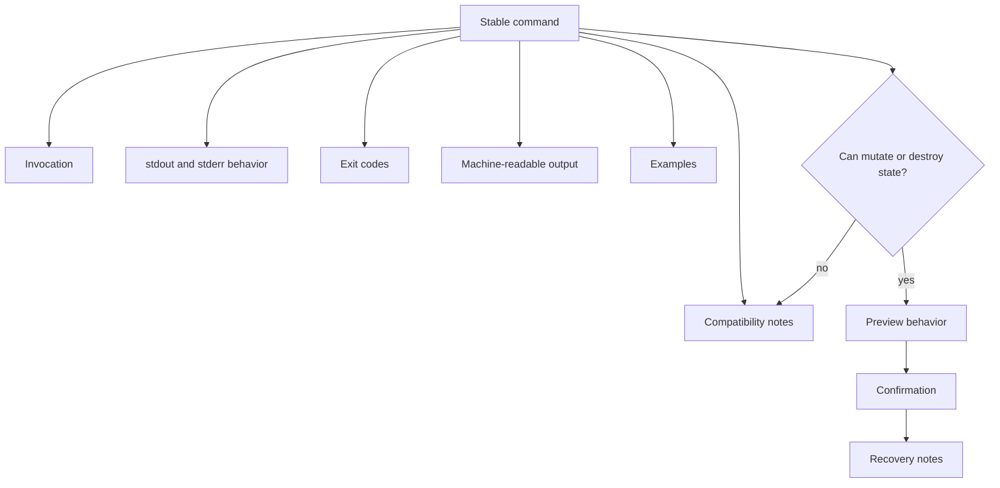

# Command Tool Standard (CTS)

CTS governs command-line tools and automation utilities. It makes CLI behavior stable enough for humans, scripts, and agents to rely on.

## Document Suite

| File | Purpose |
| --- | --- |
| `Command Tool Standard.md` | Primary CTS specification. |
| `CTS.manifest.toml` | Standard manifest. |
| `templates/Command-Contract.md` | Command documentation template. |
| `templates/CLI-Release-Checklist.md` | Release readiness template. |
| `examples/Manifest-Audit-Command-Contract.md` | Filled command contract example. |
| `Adoption-Guide.md` | How CLI projects adopt CTS. |
| `Validation-Checklist.md` | Manual CTS readiness checks. |
| `CHANGELOG.md` | CTS version history. |

## SFDS Suite Model

`CTS.manifest.toml` describes CTS as a standard suite.
The templates in `templates/` describe command contracts and CLI release records governed by CTS.

## Core Contract

Every stable command needs documented invocation, stdout/stderr behavior, exit codes, machine-readable output shape when applicable, examples, and compatibility notes. Destructive commands must document preview, confirmation, and recovery behavior.

## Validation Posture

CTS is currently operational through `CommandOutput.schema.json`, the command-contract template, the CLI release checklist, filled examples, the adoption guide, and the manual validation checklist. Automated command-contract or output-envelope validation is future maturity work, not a blocker for CTS adoption today.

The `validators` list in `CTS.manifest.toml` is intentionally empty until a real CTS validator exists. Reviews should record that as backlog only when useful and should not treat it as a broken current capability.

