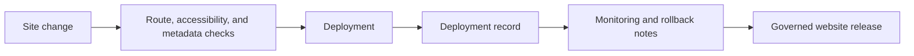

# Website Development Standard (WDS)

WDS governs websites and web applications as maintained projects rather than loose page collections. It requires deployment evidence, accessibility and metadata checks, route verification, rollback expectations, and monitoring notes.

## Document Suite

| File | Purpose |
| --- | --- |
| `Website Development Standard.md` | Primary WDS specification. |
| `WDS.manifest.toml` | Standard manifest. |
| `templates/Site-Manifest.toml` | Site manifest template. |
| `templates/Deployment-Record.md` | Deployment record template. |
| `examples/Example-Deployment-Record.md` | Filled deployment evidence example. |
| `Adoption-Guide.md` | How web projects adopt WDS. |
| `Validation-Checklist.md` | Site readiness checklist. |
| `CHANGELOG.md` | WDS version history. |

## SFDS Suite Model

`WDS.manifest.toml` describes WDS as a standard suite.
The templates in `templates/` describe site manifests and deployment records governed by WDS.

## Validation Posture

WDS is currently operational through `SiteManifest.schema.toml`, the site manifest template, the deployment record template, filled examples, the adoption guide, and the manual validation checklist. Automated website validation is future maturity work, not a blocker for WDS adoption today.

The `validators` list in `WDS.manifest.toml` is intentionally empty until a real WDS validator exists. Reviews should record that as backlog only when useful and should not treat it as a broken current capability.

## Publication Rule

A deployment without a deployment record is a file upload, not a governed website release.

